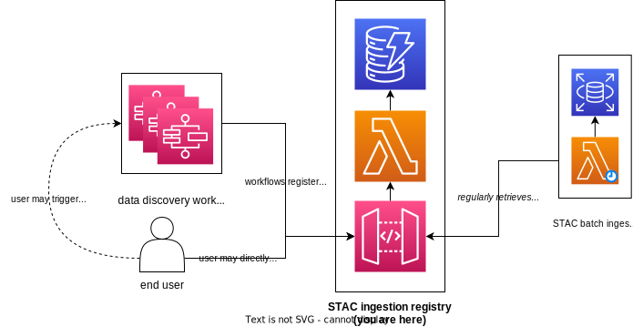

# VEDA STAC Ingestor

This service provides an entry-point for users/services to add new records to the VEDA data catalog (Spatio-Temporal Asset Catalog, STAC). 
Its primary functions are to 1) validate the STAC Items before insertion, 2) batch the insertions to reduce load on our STAC database.

STAC items are validated to ensure that:

1. It meets the [STAC Specification](https://github.com/radiantearth/stac-spec/)
1. All assets are accessible
1. Its collection exists




## Development

### Configuration

This codebase utilizes the [Pydantic SSM Settings](https://github.com/developmentseed/pydantic-ssm-settings) module to attempt to load configuration from [AWS SSM Parameter Store](https://docs.aws.amazon.com/systems-manager/latest/userguide/systems-manager-parameter-store.html).

### Running API

1. Create virtual environment:

   ```bash
   python3 -m venv .venv
   source .venv/bin/activate
   ```

2. Install dependencies:

   ```
   pip install -r requirements.txt -r api/requirements.txt
   ```

3. Run API:

   ```
   python api/local.py
   ```

   _Note:_ If no `.env` file is present, the API will connect to resources in the `dev` deployment via [pydantic-ssm-settings](https://github.com/developmentseed/pydantic-ssm-settings). This requires that your `AWS_PROFILE` be set to the profile associated with the AWS account hosting the `dev` deployment.


## Using the API

Please go through the [VEDA Contributing Docs](https://nasa-impact.github.io/veda-docs/contributing/dataset-ingestion/index.html) for a guide on ingesting and publishing data to the VEDA data store & STAC API.


## Deployment

### Fetch environment variables using AWS CLI

To retrieve the variables for a stage that has been previously deployed, the secrets manager can be used to quickly populate an .env file.
> Note: The environment variables stored as AWS secrets are manually maintained and should be reviewed before using.

```
export AWS_SECRET_ID=stac-ingestor-env-secret-<stage>

aws secretsmanager get-secret-value --secret-id ${AWS_SECRET_ID} --query SecretString --output text | jq -r 'to_entries|map("\(.key)=\(.value|tostring)")|.[]' > .env
```

This script is also available at `scripts/sync_env.sh`, which can be invoked with the secret name as an argument:

```
. scripts/sync_env.sh stac-ingestor-env-secret-<stage>
```


## License

This project is licensed under **Apache 2**, see the [LICENSE](LICENSE) file for more details.
