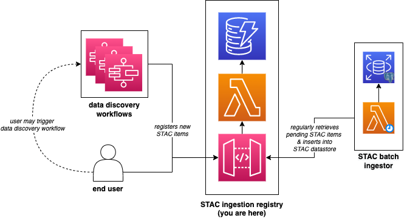

# VEDA STAC Ingestion System

This service acts as a staging area for STAC items that are to be ingested into the VEDA STAC catalog.

STAC items are validated to ensure that:

1. It meets the [STAC Specification](https://github.com/radiantearth/stac-spec/)
1. All assets are accessible
1. Its collection exists



## Development

### Running API

1. Create virtual environment:
   ```bash
   python3 -m venv .venv
   source .venv/bin/activate
   ```
1. Install dependencies:
   ```
   pip install -r api/requirements.txt
   ```
1. Run API:

   ```
   uvicorn api.src.main:app --reload
   ```

   _Note:_ If no `.env` file is present, the API will connect to resources in the `dev` deployment via [pydantic-ssm-settings](https://github.com/developmentseed/pydantic-ssm-settings). This requires that your `AWS_PROFILE` be set to the profile associated with the AWS account hosting the `dev` deployment.
