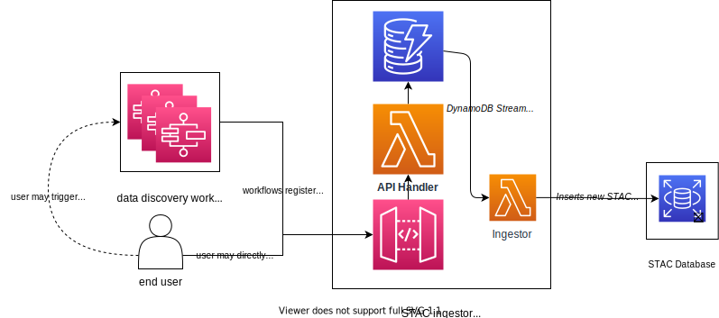

# VEDA STAC Ingestor

This service provides an entry-point for users/services to add new records to our STAC database. Its primary functions are to 1) validate the STAC Items before insertion, 2) batch the insertions to reduce load on our STAC database.

STAC items are validated to ensure that:

1. It meets the [STAC Specification](https://github.com/radiantearth/stac-spec/)
1. All assets are accessible
1. Its collection exists



## Development

### Configuration

This codebase utilizes the [Pydantic SSM Settings](https://github.com/developmentseed/pydantic-ssm-settings) module to attempt to load configuration from [AWS SSM Parameter Store](https://docs.aws.amazon.com/systems-manager/latest/userguide/systems-manager-parameter-store.html).

### Running API

1. Create virtual environment:

   ```bash
   python3 -m venv .venv
   source .venv/bin/activate
   ```

1. Install dependencies:

   ```
   pip install -r api/requirements.txt
   ```

1. Run API:

   ```
   uvicorn api.src.main:app --reload
   ```

   _Note:_ If no `.env` file is present, the API will connect to resources in the `dev` deployment via [pydantic-ssm-settings](https://github.com/developmentseed/pydantic-ssm-settings). This requires that your `AWS_PROFILE` be set to the profile associated with the AWS account hosting the `dev` deployment.

## Using the API

Please go through the [API Usage docs](API_usage.md) for a guide on ingesting and publishing data to the VEDA data store & STAC API.

## License

This project is licensed under **Apache 2**, see the [LICENSE](LICENSE) file for more details.
